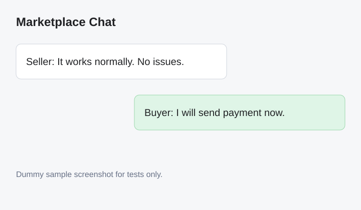
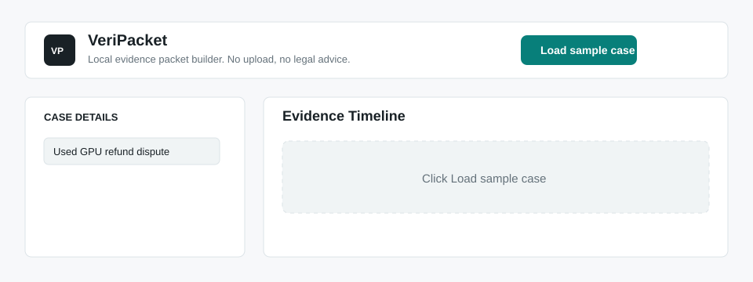
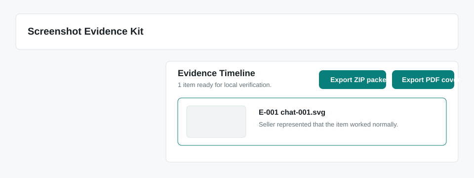
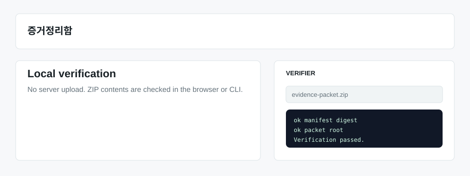

# 증거정리함 (VeriPacket)

> [!IMPORTANT]
> Active development moved to
> [`cloud7-dev/open-personal-records-toolkit`](https://github.com/cloud7-dev/open-personal-records-toolkit/tree/main/apps/veripacket).

증거정리함 is the Korean user-facing name for VeriPacket: local-first tools and public technical documents for turning dispute screenshots into chronological, verifiable evidence packets.

This repository publishes the **Open Evidence Packet Format**, a technical packet format for organizing screenshots, redactions, hashes, and review notes. It is not a legal evidence standard, does not provide legal advice, and does not guarantee admissibility in any court, agency, marketplace, or platform process.

## Live Demo

Use the hosted static app:

https://cloud7-dev.github.io/screenshot-evidence-kit/

The app runs in your browser. Screenshots are processed locally and are not uploaded by this public core. The Korean app name is **증거정리함**; the technical OSS/core name remains **VeriPacket**.

Sample evidence screenshot:



## What It Does

- Builds a timeline from dispute screenshots.
- Creates separate redacted submission renders.
- Exports `evidence-packet.zip` with `manifest.json`, `hashes.txt`, `packet.html`, `packet.pdf`, `rendered/`, and optional `originals/`.
- Verifies ZIP packets, SHA-256 file hashes, manifest digest, and packet root locally.
- Runs a local Smart Review for missing timestamps, generic sources, thin notes, duplicate files, original-exclusion limits, and possible sensitive metadata.
- Provides Korea and United States general-information checklist groundwork.

## What It Does Not Do

- It does not provide legal advice.
- It does not recommend lawyers.
- It does not guarantee admissibility.
- It does not prove screenshot contents are true.
- It does not use blockchain in v0.4.
- It does not run OCR or AI image understanding in the dependency-free public app yet.

## Demo Flow







## Use The Local Web App

This project is a static local web app. No build step is required.

```bash
python3 -m http.server 4173
```

Then open:

```text
http://127.0.0.1:4173/
```

Core workflow:

1. Add screenshots by drag and drop, file picker, or clipboard paste.
2. Edit case details, country mode, timeline source, timestamp, and notes.
3. Add opaque redaction rectangles to create a separate submission render.
4. Check Smart Review warnings for missing timestamps, generic sources, short notes, duplicate files, or sensitive metadata hints.
5. Keep `Include originals in ZIP` on for full local verification, or turn it off for a privacy-reduced packet.
6. Export `evidence-packet.zip` or a standalone `packet.pdf` cover.
7. Verify the ZIP, manifest folder, or manifest file locally.

`packet.html` is designed for browser print-to-PDF. v0.4 also exports a basic `packet.pdf` cover containing the manifest digest, packet root, timeline, Smart Review summary, and limitations.

## What Is Public

- Evidence manifest schema
- SHA-256 verification model
- Redaction metadata model
- Sample evidence packets
- Local verifier CLI
- Integrity and limitation docs

## What Is Not In This Public Core

- Lawyer matching or referral workflows
- Paid legal-pack operations
- Lawyer or customer network data
- Payment, ad ranking, or profile placement systems
- Advanced OCR or AI privacy review
- Hosted SaaS dashboards

## v1 Integrity Model

v1 is blockchain-free:

- Hash original imported files with SHA-256.
- Hash redacted/submission renders separately.
- Canonicalize the manifest JSON.
- Compute the manifest digest.
- Embed the digest in exported PDFs or packet summaries.
- Verify the packet locally with no server upload.

Optional RFC 3161 or OpenTimestamps proof can be added later for existence-time proof of the manifest digest only. It must not be marketed as "blockchain court evidence."

## Quick Verify

```bash
node scripts/veripacket-verify.mjs verify examples/marketplace-refund
node scripts/veripacket-verify.mjs verify examples/marketplace-refund/evidence-packet.zip
```

The command checks file hashes, recomputes the canonical manifest digest, and reports whether the packet is intact.

Expected sample result:

```text
ok manifest digest
ok packet root
ok E-001.original
ok E-001.rendered
ok artifact:packet.html
ok hashes.txt:originals/chat-001.svg
ok hashes.txt:rendered/chat-001-redacted.svg
ok hashes.txt:packet.html
ok hashes.txt:packet.pdf

Verification passed. manifestDigest=0f76f4d69220add7fc6aca6e441ec212a3a3f082eed9128c1c66e47a60985156
Smart Review: 100/100 (pass)
```

You can also verify a manifest file directly:

```bash
node scripts/veripacket-verify.mjs verify examples/marketplace-refund/manifest.json
```

## Packet Format Notes

- `packetArtifacts` lists generated packet files such as `packet.html`; `hashes.txt` is exported as a readable companion checksum file.
- `packet.pdf` is a companion export listed in `hashes.txt` because it includes the final manifest digest and would otherwise create a circular artifact hash.
- `packetRoot` is a Merkle root over evidence item original/rendered hashes.
- `manifestDigest` is computed from canonical JSON with `integrity.manifestDigest` zeroed during calculation.
- `packetOptions.originalsIncluded=false` means original file hashes remain recorded, but original file reads are skipped unless those files are supplied separately.
- `review` records the local Smart Review score and findings. v0.4 review is metadata-based: it checks timestamps, source labels, notes, file duplication, original-exclusion limits, and sensitive text hints from user-entered fields and filenames. It does not inspect image pixels.
- Timestamp proof is intentionally optional and not part of v0.4.

## Repository Layout

```text
index.html                  Local web app entrypoint
app.js                      Browser-only packet builder and verifier
styles.css                  App UI styles
schema/                     Open Evidence Packet Format schema
docs/                       Integrity, redaction, and boundary docs
docs/smart-review.md        v0.4 local packet-quality review scope
legal-packs/                KR/US general-information checklist drafts
scripts/veripacket-verify.mjs      Node CLI verifier
examples/                   Sample evidence packet fixtures
outputs/                    Research and product planning artifacts
```

## License

Apache-2.0. See [LICENSE](LICENSE).
